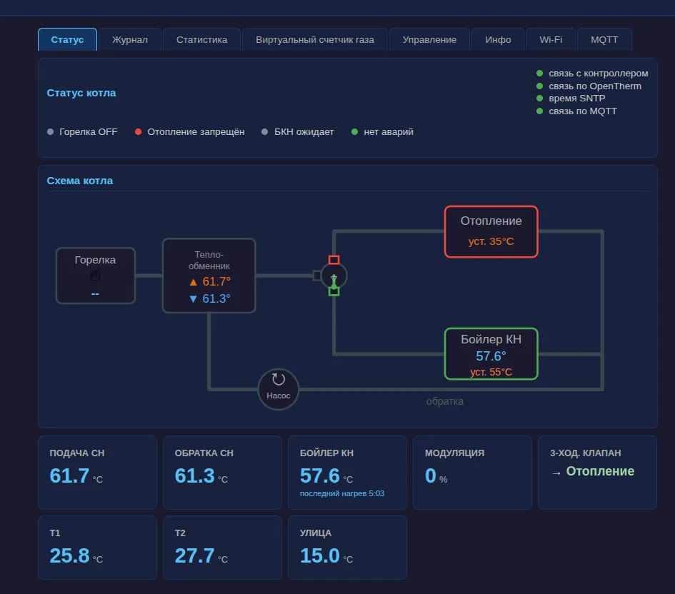
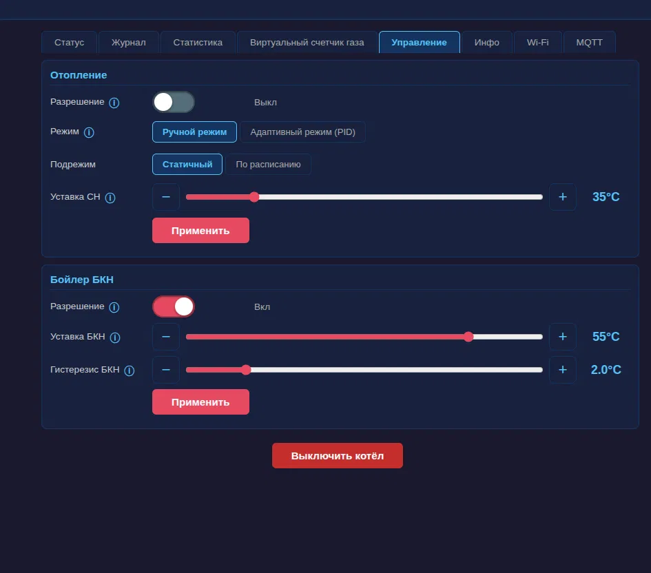
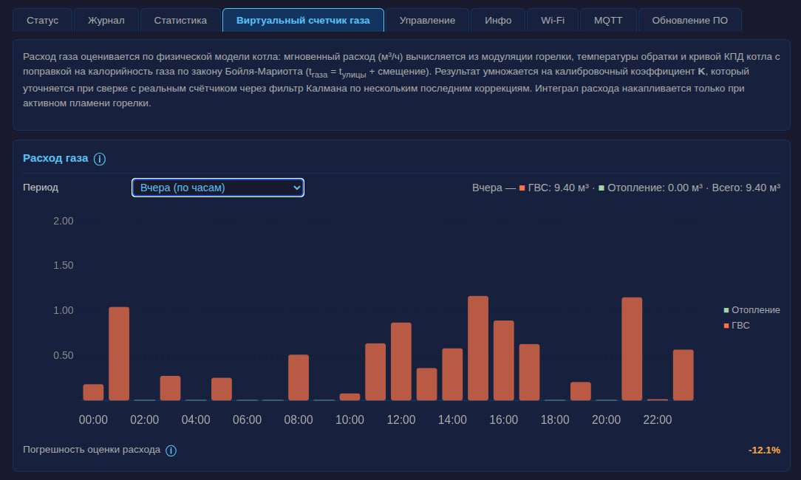
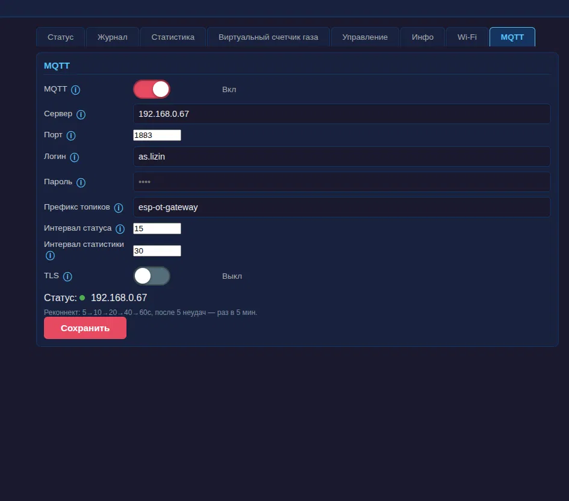
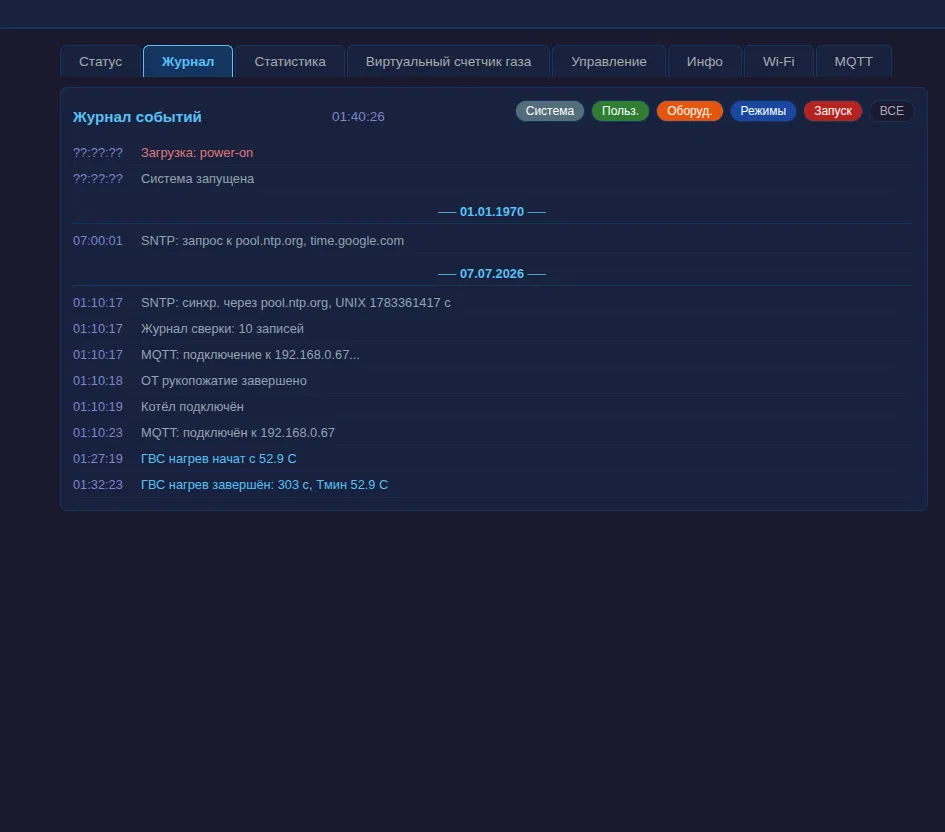
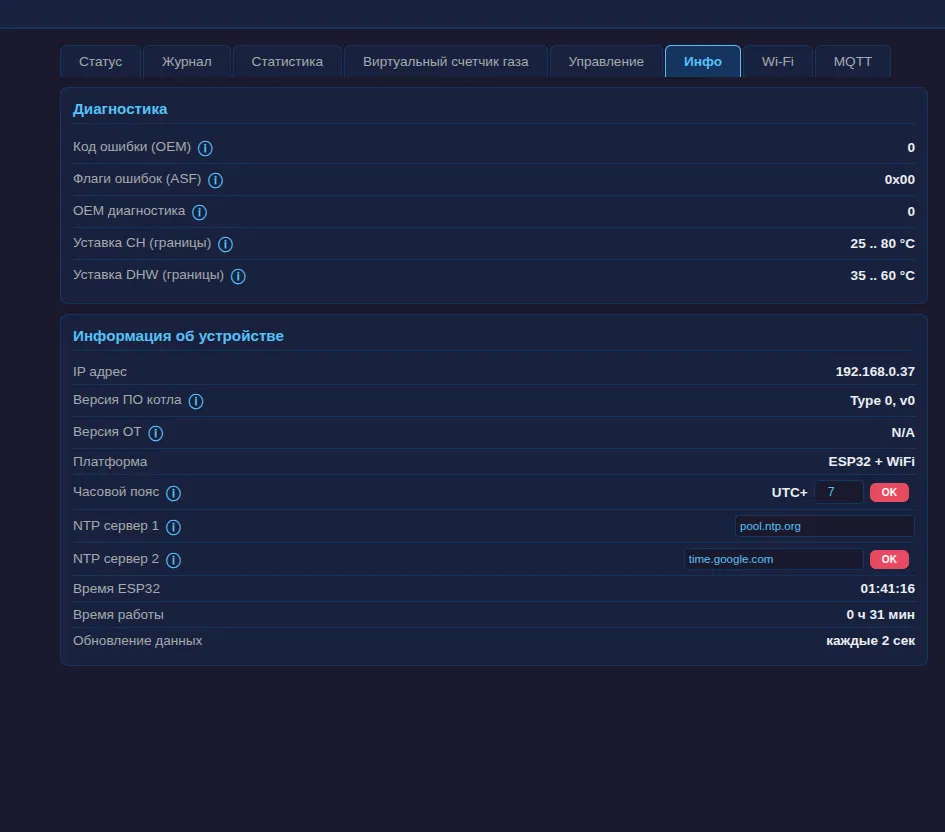
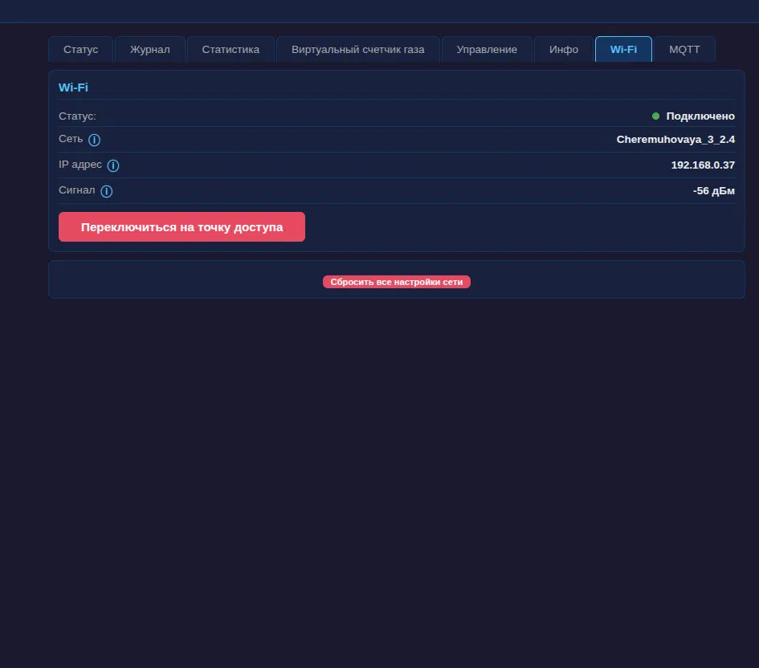

# ESP OpenTherm Gateway

[English](docs/README.en.md) | **Русский**

**Превратите газовый котёл в умную систему отопления — по цене одного ESP32.**

[](https://github.com/sogimu/esp-ot-gateway/actions/workflows/tests.yml)
[](https://sogimu.github.io/esp-ot-gateway/coverage/)

Большинство газовых котлов всю жизнь щёлкает релейный термостат: полная мощность, перегрев, остывание, снова полная мощность. А ведь котёл умеет лучше — он говорит на **OpenTherm**, цифровом протоколе, который позволяет плавно модулировать горелку, отдавать все измеряемые температуры и честно рассказывать, что происходит внутри.

**esp-ot-gateway** — открытая прошивка для ESP32, которая раскрывает всё это:

- 🔥 **Плавное модулирующее отопление** — PID-регулирование по температуре в комнате вместо циклов вкл/выкл: стабильная температура, меньше стартов горелки, меньше износ
- 💰 **Знайте счёт за газ до его прихода** — оценка расхода газа в реальном времени (м³/ч), потребление за день/неделю, калибровка по показаниям реального счётчика
- 🏠 **Home Assistant из коробки** — MQTT-автообнаружение публикует 29 сущностей: укажите адрес брокера, и котёл сам появится в HA
- 📱 **Управление с любого устройства** — быстрый веб-дашборд с тёмной темой прямо с ESP32; без приложений и аккаунтов
- ☁️ **Никакого облака. Вообще.** — всё работает в вашей локальной сети. Никаких подписок, отключаемых серверов и утечек данных из дома
- 🚿 **Горячая вода — с прогнозом** — фильтр Калмана оценивает, когда нагреется бойлер («горячая вода через ~12 минут»)
- ⏰ **Суточное расписание** — почасовые уставки отопления, синхронизация времени по NTP с поддержкой часовых поясов

> Ежедневно работает на котле **Baxi Duo-tec Compact 1.24** с OpenTherm-адаптером SmartTherm. Прошивка реализует полноценный OpenTherm-мастер v2.2, поэтому другие котлы с OpenTherm должны работать — отчёты о совместимости и pull request'ы очень приветствуются.

---

## Скриншоты

| Живая схема котла | Управление: режимы и уставки |
|---|---|
|  |  |

| Виртуальный счётчик газа со сверкой | Настройки MQTT |
|---|---|
|  |  |

<details>
<summary>Ещё скриншоты: журнал событий, Инфо, WiFi</summary>





</details>

---

## Почему не купить готовый умный термостат?

| | Релейный «умный» термостат | Фирменный OT-термостат | **esp-ot-gateway** |
|---|---|---|---|
| Модуляция котла | ❌ только вкл/выкл | ✅ | ✅ PID с вашей настройкой |
| Учёт расхода газа | ❌ | редко | ✅ с журналом калибровки по счётчику |
| Home Assistant / MQTT | через облако | через облако | ✅ полностью локально |
| Логика бойлера ГВС и прогноз | ❌ | ❌ | ✅ |
| Цена | $$ | $$$ | ESP32 + OT-адаптер |
| Прошивка | закрытая | закрытая | исходный код открыт, 400+ юнит-тестов |

---

## Что понадобится

| Компонент | Примечания |
|---|---|
| Плата ESP32 | любой распространённый DevKit (240 МГц, WiFi) — [проверенная плата](https://ozon.ru/t/91Jlr6E) |
| OpenTherm-адаптер | адаптер уровней типа SmartTherm между GPIO ESP32 и OT-шиной котла |
| Газовый котёл с OpenTherm | проверено: [Baxi Duo-tec Compact 1.24](https://shop.baxi.ru/products/duo-tec-compact-1-24) |
| *(опционально)* 2 × DS18B20 | комнатные датчики температуры для PID-регулирования (GPIO 15 / 26) |
| *(опционально)* MQTT-брокер | например, Mosquitto в Home Assistant — для интеграции с умным домом |

Подключение: OT TX → GPIO 4, OT RX → GPIO 16, отказобезопасное реле → GPIO 23 (замыкается при загрузке, размыкается при пропадании питания — если ESP32 «умрёт», котёл вернётся к собственному управлению).

---

## Запуск за 15 минут

1. **Прошейте плату**

   ```bash
   bash scripts/setup.sh                  # ставит ESP-IDF и тулчейн (Ubuntu)
   source ~/esp/esp-idf/export.sh
   bash scripts/build_and_flash.sh /dev/ttyUSB0
   ```

2. **Подключите к WiFi — без правки кода.** При первом старте устройство поднимает WiFi-сеть **`Baxi-OT-Setup-XXXXXX`**. Подключитесь с телефона — страница настройки откроется сама (или зайдите на `http://192.168.4.1`), выберите домашнюю сеть *или* оставьте устройство работать собственной точкой доступа — оно полностью работоспособно и без интернета. Мигающий синий светодиод означает лишь «WiFi-соединение ещё не установлено» — после подключения он успокоится ([подробнее](docs/wifi-setup.md)).

3. **Откройте дашборд** по адресу `http://<ip-устройства>` — перед вами живое состояние котла: пламя, модуляция, температуры подачи/обратки, положение трёхходового клапана.

4. *(опционально)* **Подключите Home Assistant:** дашборд → вкладка **MQTT** → адрес брокера, логин и пароль → Сохранить. Шлюз объявит себя через MQTT-автообнаружение, и котёл появится в HA готовым устройством.

Подробная настройка WiFi, диагностика и сброс к заводским настройкам: **[Настройка WiFi](docs/wifi-setup.md)**.

---

## Интеграция с Home Assistant

Шлюз публикует **29 автообнаруживаемых сущностей** — без единой строчки YAML:

- **Сенсоры (9):** подача и обратка отопления, бойлер ГВС, улица, комнаты T1/T2, модуляция % и другие
- **Бинарные сенсоры (5 + системные):** пламя, отопление активно, ГВС активно, авария, синхронизация времени
- **Управление:** переключатели отопления и ГВС, уставка отопления (20–80 °C) и уставка ГВС, режим отопления
- **Прогноз ГВС (6):** оставшееся время нагрева и его неопределённость для текущей сессии горячей воды
- **Журнал (2):** live-лента событий (`event.journal`) и последнее событие (`sensor.last_event`)

Всё то же доступно и по обычным MQTT-топикам (JSON), так что Node-RED, самописные скрипты и любые дашборды работают ничуть не хуже:

- устройство → брокер: периодические сообщения **статуса** (по умолчанию каждые 30 с, настраивается 5 с – 1 ч) и **статистики**
- брокер → устройство: топик **управления**, принимающий `ch_enable`, `ch_setpoint`, `dhw_enable`, `dhw_setpoint`
- `…/cmd/ha_discovery` — повторная публикация HA-discovery по запросу

MQTT-клиент написан под круглосуточную работу на встраиваемой системе: реализация без динамических аллокаций, watchdog по keepalive, автопереподключение с backoff, повторная публикация discovery при каждом реконнекте. Поддерживается аутентификация по логину/паролю; все интервалы настраиваются из веб-интерфейса и переживают перезагрузку.

Полный справочник топиков: **[docs/mqtt.md](docs/mqtt.md)**.

---

## Дашборд

Восемь вкладок, отдаются прямо с ESP32 (см. скриншоты выше):

- **Статус** — живая схема котла (горелка, теплообменник, насос, трёхходовой клапан), все известные системе температуры, индикаторы связи (контроллер / OpenTherm / SNTP / MQTT), прогноз готовности горячей воды
- **Журнал** — журнал событий на 256 записей с фильтрами по категориям (система / пользователь / оборудование / режимы / запуск); синхронизация SNTP, подключения MQTT и сессии нагрева ГВС — всё прослеживается
- **Статистика** — перцентили модуляции (p1–p99), анализ циклов горение/пауза, наработка горелки в часах — отлично выявляет переразмеренный котёл и тактование
- **Виртуальный счётчик газа** — мгновенный расход (м³/ч), накопленный объём, средние за 1ч/3ч/12ч/24ч/7д, индикатор погрешности оценки и **журнал сверки**: вводите показания физического счётчика, и сглаженный фильтром Калмана калибровочный коэффициент K держит оценку честной (переживает перезагрузки)
- **Управление** — разрешение отопления; режим **Ручной** или **Адаптивный (PID)** плюс подрежим **Статичный** или **По расписанию** — суточная сетка может задавать как фиксированные уставки подачи, так и комнатные цели для PID; разрешение, уставка и гистерезис бойлера БКН; большая красная кнопка «Выключить котёл»
- **Инфо** — коды ошибок OEM/ASF, сообщённые котлом границы уставок, версии ПО котла и OpenTherm, NTP-серверы и часовой пояс, время работы
- **WiFi** — состояние подключения и RSSI, переключение в режим точки доступа, сброс сетевых настроек
- **MQTT** — настройки брокера с живым индикатором состояния и графиком переподключений прямо в интерфейсе

---

## Для инженеров

Под дружелюбным интерфейсом — кодовая база, выстроенная по канонам гексагональной архитектуры:

- **Полный стек OpenTherm-мастера v2.2** — манчестерское кодирование/декодирование через GPIO ISR и аппаратный таймер 500 мкс, с обработкой особенностей Baxi (трюк CH2_ENABLE для клапана, отклоняемые записи уставки ГВС, пауза 100 мс между кадрами)
- **Разделение domain / application / infrastructure** — логика отопления не зависит от ESP-IDF и запускается на хосте
- **400+ юнит-тестов, 1000+ проверок** — гоняются в CI под санитайзерами, отчёт о покрытии публичен
- **Диагностика сбоев** — логирование причины сброса, core dump во флеш, офлайн-разбор бэктрейса через `decode_crash.sh`
- **REST API** — каждое действие дашборда — это JSON-эндпоинт (`/api/status`, `/api/control`, `/api/stats`, `/api/schedule`, `/api/mqtt/*`, …); примеры `curl` в [docs/api.md](docs/api.md)
- **Закалённая работа с сетью** — бесконечное переподключение WiFi с экспоненциальным backoff, меры против фрагментации кучи, лестница восстановления для аптайма 24/7

Требования к сборке: ESP-IDF v5.3.x. См. **[Сборка и отладка](docs/build.md)**.

---

## Безопасность

Эта прошивка управляет настоящим отопительным оборудованием. Реле подключено отказобезопасно (при пропадании питания котёл возвращается к автономной работе), а сам OpenTherm ограничивает то, что мастер может скомандовать, — но за вашу установку отвечаете **вы**. Работайте с проводкой котла при выключенном питании, соблюдайте местные нормы, а при сомнениях — обратитесь к специалисту по отоплению. Проект не связан с компанией Baxi и не одобрен ею.

---

## Статус проекта и участие

Проект активно развивается и работает в боевом режиме на системе отопления автора не первую зиму. Особенно нужны:

- **Отчёты о совместимости** с котлами других производителей с OpenTherm (создайте issue: модель + что заработало)
- Скриншоты и дашборды ваших установок
- Баг-репорты с логами — журнал событий и диагностика сбоев делают их лёгкими в сборе

⭐ Если проект избавил вас от покупки облачного термостата — звезда поможет другим владельцам котлов его найти.

## Лицензия

**Бесплатно для личного и домашнего использования.** Исходный код доступен по лицензии [PolyForm Noncommercial License 1.0.0](https://polyformproject.org/licenses/noncommercial/1.0.0/): использовать, изучать, модифицировать и распространять прошивку можно в любых некоммерческих целях — эксплуатация на собственном котле как раз такая цель.

**Коммерческое использование** (продажа прошитых устройств, комплектация оборудования, платные услуги установки на базе этой прошивки, использование в продуктах и сервисах компаний) требует отдельной коммерческой лицензии — создайте issue или свяжитесь с автором.

Отправляя вклад (pull request), вы соглашаетесь с условиями [CONTRIBUTING.md](docs/CONTRIBUTING.md), включая передачу прав, позволяющую проекту менять лицензию вашего вклада.

Обоснование и FAQ: [LICENSING.md](docs/LICENSING.md).
